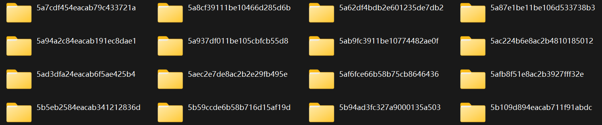
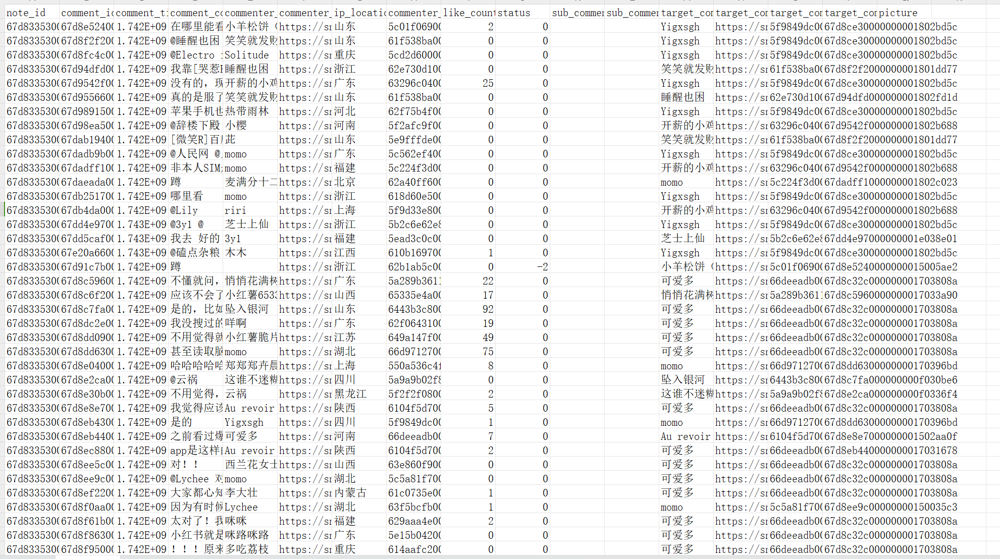
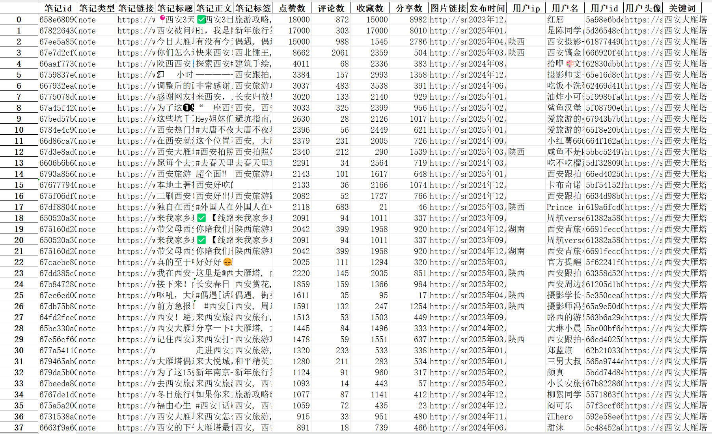

# xhs_crawler
小红书爬虫，小红书数据挖掘，数据分析

# 简介
本项目主要针对小红书web端进行数据采集，包括但不限于笔记搜索，笔记详情，笔记评论，笔记子评论，用户主页等。支持保存到Excel，csv等文件类型，支持下载图片视频等。
  

  

# 售后咨询

  zx_luckfe  
  2750149462@qq.com 
  https://t.me/luckfezx 

# 声明

作者声明：没有在任何平台进行代码售卖，请谨慎鉴别，上当受骗作者一律不负责
本项目仅供学习交流，严禁用于任何商业和非法用途，非本人使用而产生的纠纷与一切后果均与本人无关。
